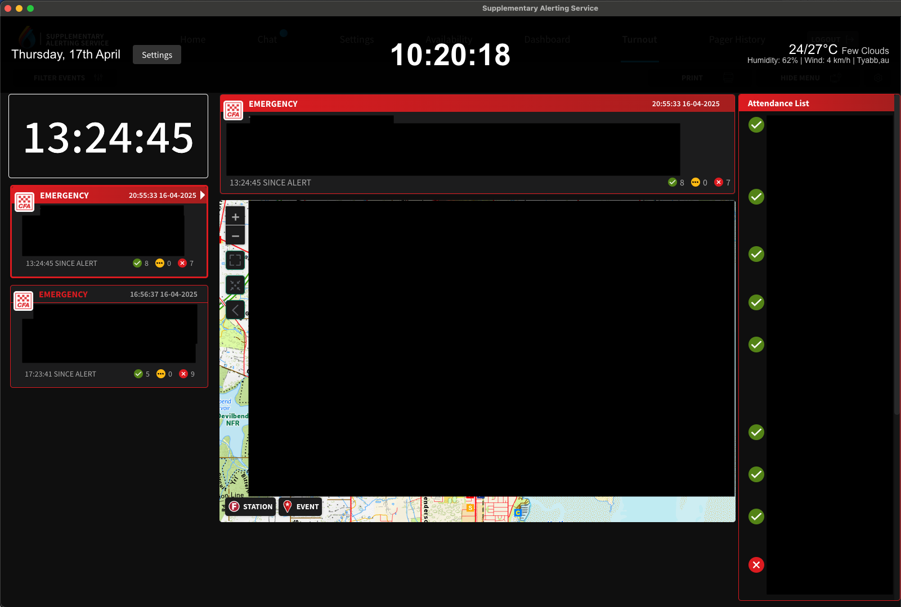
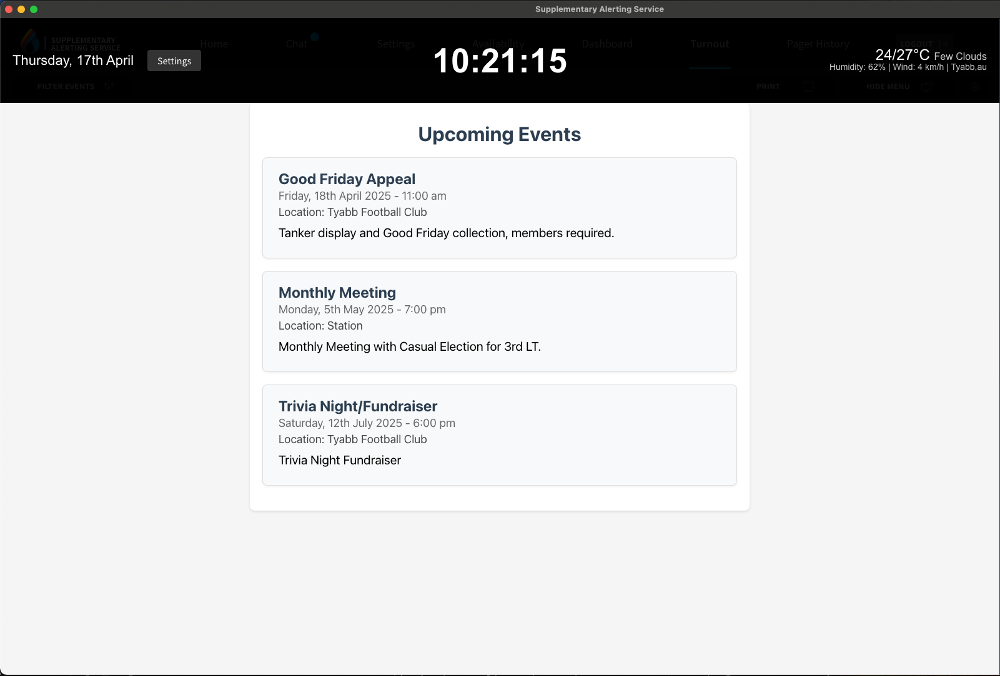
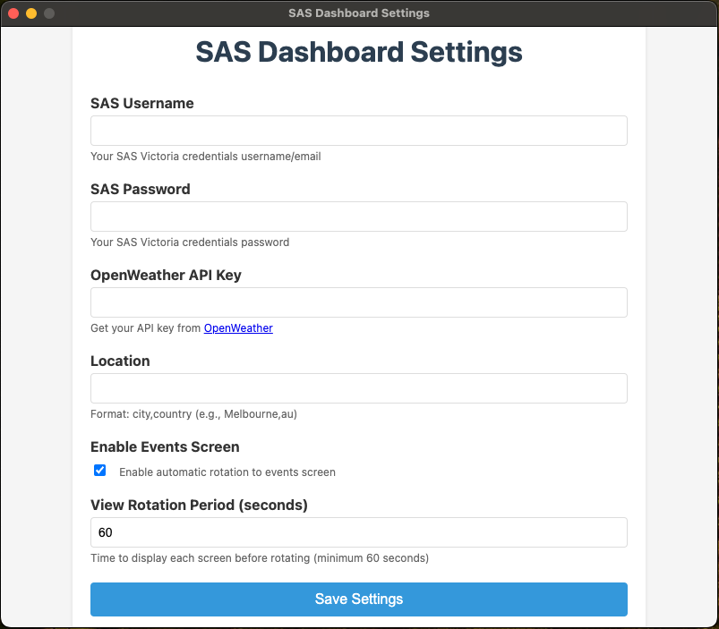
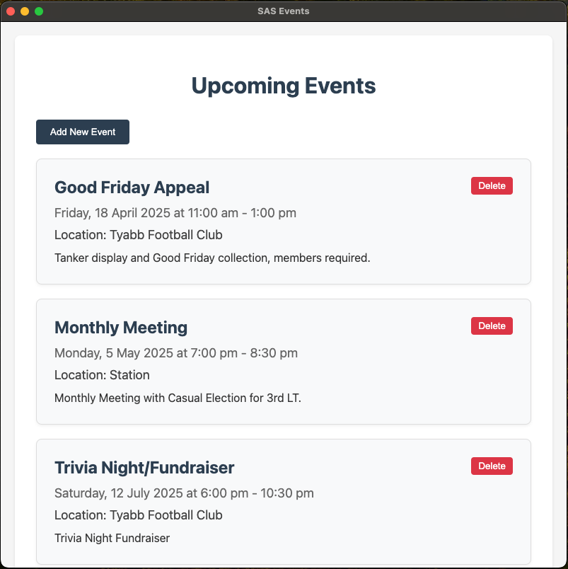

# SASIE - The SAS Interface Extension

SASIE is a customisable overlay application for the SAS Turnout Dashboard that provides real-time weather information, date, time and custom events display.

SASIE is a stand-alone application that can run on Windows, Mac and Linux in Kiosk mode without any additional configuration, browser extenstions or customisation.

## Features

- 🌤️ Real-time, location based weather information display
- 🕒 Current time and date display
- ⚙️ Configurable settings interface
- 🖥️ Seamless integration with SAS Dashboard
- 🎨 Clean, non-intrusive overlay design
- 🚀 Cross-platform support (Windows, macOS, Linux)
- 📅 Local events feed

## Usage

### For Developers

SASIE is built with ElectronJS.

The source code is currently private, but can be provided upon request if you wish to extend the application and/or add additional features specific to your requirements.

### Downloading Pre-built Binaries

Pre-built binaries are available on the [GitHub Releases](https://github.com/firehouselabs/sasie.github.io/releases) page or using the links to the left. Each release includes:

- **Windows**: Portable executable (.exe)
- **macOS**: DMG installer (.dmg)
- **Linux**: AppImage (.AppImage)

#### Installation Instructions

- **Windows**:
  1. Download the .exe file
  2. The application is portable - no installation needed
  3. Double-click to run

- **macOS**:
  1. Download the .dmg file
  2. Double-click to mount the disk image
  3. Drag the application to your Applications folder
  4. Right-click and select "Open" for first launch (required for unsigned applications)

- **Linux**:
  1. Download the .AppImage file
  2. Make it executable: `chmod +x SAS.Dashboard.Overlay-*.AppImage`
  3. Double-click to run or execute from terminal

## Configuration

The application uses a settings interface that can be accessed via the overlay's Settings button. Configure:

- SAS Login Credentials
- Weather location
- API keys
- Display preferences
- Event Information

When the application is first launched, you will be presented with the settings screen.

[!TIP]
If you omit the Weather API, the dashboard will not display any weather data. See instructions below for obtaining an OpenWeather API Key.

### Weather

SASIE uses [OpenWeather](https://openweathermap.org/) to obtain weather data to display on the dashboard, in order for this to work a free API Key is required.

#### Obtaining OpenWeather API Key

1. Sign up for a free account at [OpenWeather](https://openweathermap.org/api)
2. After signing in, go to your [API keys](https://home.openweathermap.org/api_keys) page
3. Copy your API key (or generate a new one)
4. In the application settings, paste your API key in the "Weather API Key" field

#### Setting Location

OpenWeather requires the Suburb and Country in the following format: `Suburb,au` e.g. `Melbourne,au`

[!IMPORTANT]
The free tier has a limit of 60 calls/minute, which is more than sufficient for this application.

### Events

You can add your own events, ensuring the event display is enabled in settings.

To add custom events, from the File Menu select Events.

Click Add New Event and enter the event details.

